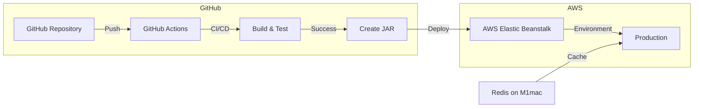

# Spring Boot Blog

Spring Boot와 Spring Security를 사용한 블로그 프로젝트입니다.   
-개발 과정   
https://ernest45.tistory.com/172

## 주요 기능

- JWT 기반 인증 시스템
- Google OAuth2 로그인
- 블로그 글 CRUD 기능
- 사용자 관리
- Redis 기반 리프레시 토큰 관리

## 기술 스택

- Java 17
- Spring Boot 3.0.2
- Spring Security
- Spring Data JPA
- MySQL
- Redis
- Thymeleaf
- JWT

## 배포 파이프라인




### 배포 프로세스

1. **GitHub Actions Workflow**
   - 코드 푸시 시 자동 트리거
   - Gradle 빌드 및 테스트 실행
   - JAR 파일 생성
   - AWS Elastic Beanstalk 배포

2. **AWS Elastic Beanstalk**
   - JAR 파일 배포
   - 자동 스케일링 구성
   - 환경 변수 관리
   - 로드 밸런싱

3. **Redis 서버**
   - Docker 기반 Redis 컨테이너
   - 리프레시 토큰 저장 및 관리
   - TTL 기반 자동 만료 처리

4. **환경 변수 관리**
   - AWS Systems Manager Parameter Store 사용
   - 보안 정보 암호화 저장
   - 환경별 설정 분리

## 시작하기

### 필수 조건

- Java 17 이상
- MySQL
- Redis
- Google OAuth2 클라이언트 ID와 시크릿

### 환경 설정

1. `.env` 파일 생성
```env
GOOGLE_CLIENT_ID=your_google_client_id
GOOGLE_CLIENT_SECRET=your_google_client_secret
REDIS_HOST=localhost
REDIS_PORT=6379
```

2. `application.yml` 설정
```yaml
spring:
  security:
    oauth2:
      client:
        registration:
          google:
            client-id: ${GOOGLE_CLIENT_ID}
            client-secret: ${GOOGLE_CLIENT_SECRET}
            scope:
              - email
              - profile
  redis:
    host: ${REDIS_HOST}
    port: ${REDIS_PORT}
```

### 실행 방법

1. 프로젝트 클론
```bash
git clone [repository-url]
```

2. 의존성 설치
```bash
./gradlew build
```

3. Redis 서버 실행
```bash
docker run -d --name redis -p 6379:6379 redis:latest
```

4. 애플리케이션 실행
```bash
./gradlew bootRun
```

## API 엔드포인트

### 인증
- `POST /api/token`: JWT 토큰 발급
- `GET /oauth2/authorization/google`: Google OAuth2 로그인
- `POST /api/token/refresh`: 리프레시 토큰으로 액세스 토큰 재발급

### 블로그
- `GET /api/articles`: 블로그 글 목록 조회
- `POST /api/articles`: 블로그 글 작성
- `GET /api/articles/{id}`: 블로그 글 상세 조회
- `PUT /api/articles/{id}`: 블로그 글 수정
- `DELETE /api/articles/{id}`: 블로그 글 삭제

### 사용자
- `POST /api/users/signup`: 회원가입
- `POST /api/users/verify-email`: 이메일 인증
- `POST /api/users/follow/{userId}`: 사용자 팔로우
- `DELETE /api/users/follow/{userId}`: 사용자 언팔로우

## 보안

- JWT를 사용한 인증
- Spring Security를 통한 OAuth2 인증
- Redis를 사용한 리프레시 토큰 관리
- CSRF 보호
- 적절한 보안 헤더 설정

## 리팩토링
kakao OAuth2 추가   
https://ernest45.tistory.com/202

## 트러블 슈팅
AWS Elastic Beanstalk 배포 중 build 실패 대처   
https://ernest45.tistory.com/191

배포 후 Oauth2 500 에러? -트러블 슈팅   
https://ernest45.tistory.com/193

다중 SecurityFilterChain 우선 순위 : 트러블 슈팅   
https://ernest45.tistory.com/212

OAuth2 카카오 도전기 중 트러블 슈팅   
https://ernest45.tistory.com/218

db로 관리하는 refresh Token을 redis로 관리해보기
https://ernest45.tistory.com/231


## 라이센스

이 프로젝트는 MIT 라이센스를 따릅니다. 
